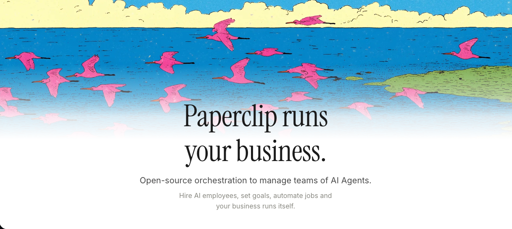
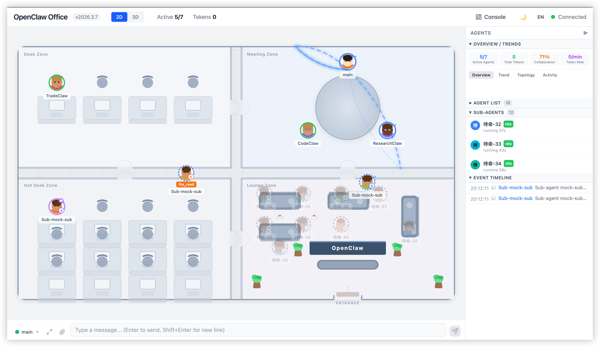
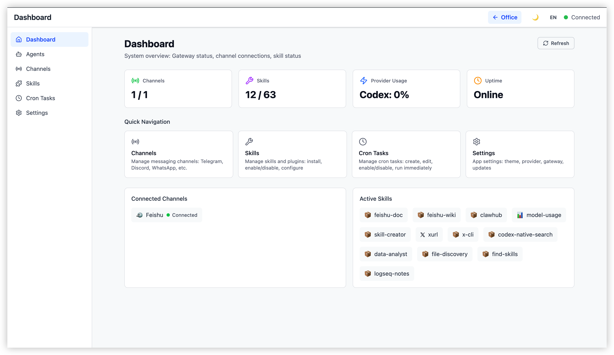
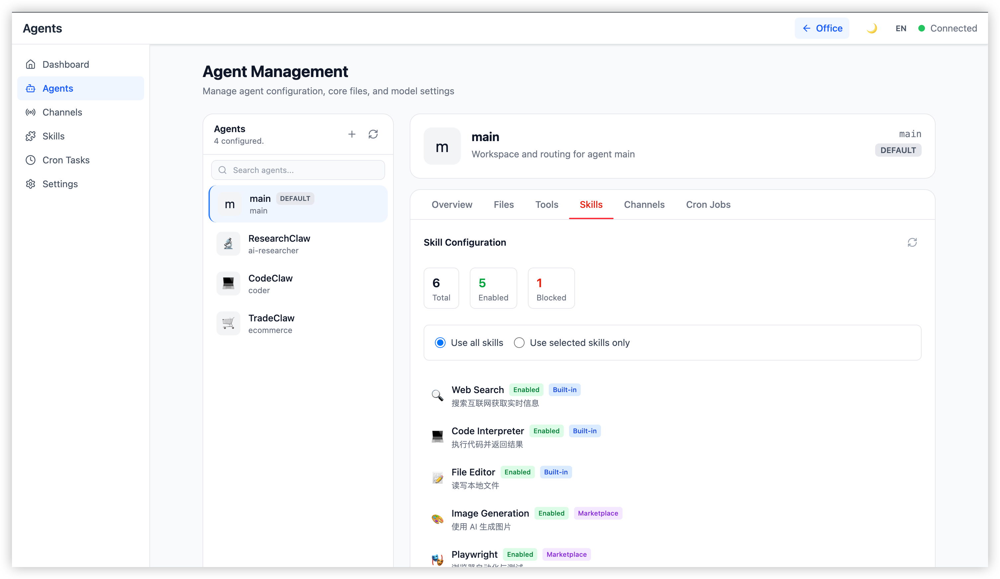

<p align="center">
  
</p>

<h1 align="center">Opensens Agent Swarm</h1>

<p align="center">
  <strong>A unified agentic research platform for the DarkLab distributed AI cluster</strong>
</p>

<p align="center">
  
  
  
  
  
</p>

---

## What is this?

**Opensens Agent Swarm (OAS)** is a self-governing AI research lab that runs autonomous scientific research on a Mac mini cluster. It merges:

- **DarkLab's agent infrastructure** &mdash; dispatch routing, budget enforcement, 14 research skills, multi-AI cross-validation
- **Agentic frameworks** &mdash; LangGraph Swarm, OpenViking memory, agency-agents personas, deepagents harness
- **Paperclip governance** &mdash; org chart, issues, approvals, budgets, cost ledger
- **Agent Office visualization** &mdash; real-time 2D/3D digital office with DRVP event streaming

Every request &mdash; from a Telegram command to a multi-step research campaign &mdash; flows through a governed pipeline with real-time visual feedback.

<p align="center">
  
</p>

---

## Screenshots

<table>
  <tr>
    <td align="center"><strong>2D Office Floor Plan</strong></td>
    <td align="center"><strong>3D Office View</strong></td>
  </tr>
  <tr>
    <td></td>
    <td></td>
  </tr>
  <tr>
    <td align="center"><strong>Console Dashboard</strong></td>
    <td align="center"><strong>Agent Management</strong></td>
  </tr>
  <tr>
    <td></td>
    <td></td>
  </tr>
</table>

---

## Architecture

```
                            +-----------------------+
                            |   Boss (MacBook Pro)  |
                            |  SSH / Telegram / Web |
                            +-----------+-----------+
                                        |
                          Telegram msg / SSH cmd
                                        |
                                        v
+-------------------------------  LEADER (Mac mini)  --------------------------------+
|                                  192.168.23.25                                      |
|                                                                                     |
|   +-------------+   +-----------+   +----------------+   +-------------------+      |
|   |  PicoClaw    |   | OpenClaw  |   | DarkLab Leader |   |    LiteLLM        |      |
|   |  Telegram    |-->| Gateway   |-->|   FastAPI       |-->|  Model Router     |      |
|   |  Bot         |   |  :18789   |   |    :8100        |   |    :4000          |      |
|   +-------------+   +-----------+   +-------+--------+   +-------------------+      |
|                                             |                                        |
|   +-------------+   +-----------+   +-------v--------+   +-------------------+      |
|   | Opensens    |   | Paperclip |   |     Redis       |   |   PostgreSQL      |      |
|   | Office      |<--| AI Gov    |<--|    Pub/Sub      |   |    :5432          |      |
|   |  :5180      |   |  :3100    |   |    :6379        |   |                   |      |
|   +-------------+   +-----------+   +----------------+   +-------------------+      |
|                                                                                     |
+-------------------------------------------------------------------------------------+
          |  OpenClaw node.invoke                    |  OpenClaw node.invoke
          v                                          v
+-------------------+                    +---------------------+
| Academic (Mac mini)|                    | Experiment (Mac mini)|
|                   |                    |                     |
| - research        |                    | - simulate          |
| - literature      |                    | - analyze           |
| - doe             |                    | - synthetic         |
| - paper           |                    | - report-data       |
| - perplexity      |                    | - autoresearch      |
| - browser_agent   |                    |                     |
+-------------------+                    +---------------------+
```

---

## Dispatch Flow

```
Incoming text ──> audit.log ──> memory.pre_load (inject prior_context)
                                        |
                                  parse_command(text)
                                        |
                           ┌────────────┴────────────┐
                        /command                   free-form
                           |                          |
                     ROUTING TABLE              get_swarm_app()
                           |                          |
                           |                   ┌──────┴──────┐
                           |                 swarm         campaign
                           |                   |              |
                           |            _dispatch_via     plan_campaign()
                           |              _swarm             |
                           |                   |        governance gate
                           |                   |              |
                           |                   |      ┌───────┴───────┐
                           |                   |   approved        pending
                           |                   |      |               |
                           |                   |  CampaignEngine   return
                           |                   |  (parallel DAG)    plan
                           └───────────────────┴──────┘
                                        |
                                   TaskResult
                                        |
                           ┌────────────┴────────────┐
                     audit.log                   DRVP emit
                                            (25 event types)
                                                 |
                                    ┌────────────┴────────────┐
                               Redis Pub/Sub           Paperclip Bridge
                                    |                         |
                              Leader SSE              drvp-issue-linker
                                    |                    (auto-create
                             DrvpSseClient              issues, costs,
                                    |                    approvals)
                           ┌────────┴────────┐
                      drvp-store        office-store
                      (timeline)     (visual status)
```

---

## DRVP (Dynamic Request Visualization Protocol)

25 event types flow through the middleware pipeline, enabling real-time visualization:

| Category | Events | Visual Effect |
|----------|--------|---------------|
| **Request** | `request.created`, `request.completed`, `request.failed` | Issue lifecycle in Paperclip |
| **Agent** | `agent.thinking`, `agent.responding`, `agent.error`, `agent.idle` | Avatar status animation |
| **Handoff** | `handoff.initiated`, `handoff.completed` | Agent-to-agent connection line |
| **LLM** | `llm.call.started`, `llm.call.completed`, `llm.call.boosted` | Token/cost metrics update |
| **Campaign** | `campaign.started`, `campaign.step.*`, `campaign.completed` | Progress bar + step tracking |
| **Budget** | `budget.warning`, `budget.exhausted` | Red alert + agent error state |
| **Governance** | `campaign.approval.required`, `campaign.approval.granted` | Approval panel notification |
| **Memory** | `memory.loaded`, `memory.stored` | Context indicator |
| **Browser** | `browser.navigate`, `browser.action`, `browser.blocked` | Domain security events |

---

## Project Structure

```
Opensens Agent Swarm/
│
├── core/                          # Shared framework (24 modules, 4,750 LOC)
│   └── oas_core/
│       ├── swarm.py               # LangGraph swarm builder
│       ├── handoff.py             # Governed handoff tool factory
│       ├── memory.py              # OpenViking HTTP client + session continuity
│       ├── persona.py             # Agency-agents persona loader (16 agents)
│       ├── campaign.py            # Campaign engine (DAG + parallel execution)
│       ├── evaluation.py          # Self-evaluation (rule + LLM scoring)
│       ├── deep_agent.py          # Deepagents subprocess wrapper
│       ├── sandbox.py             # NemoClaw sandbox manager
│       ├── middleware/            # Pipeline: budget → audit → governance → memory
│       ├── protocols/             # DRVP events + unified event schema
│       ├── adapters/              # Paperclip REST + OpenClaw WebSocket clients
│       └── subagents/             # Claude Code CLI sub-agent
│
├── cluster/                       # DarkLab cluster agents & installer
│   └── agents/
│       ├── shared/                # Models, config, LLM client, audit, crypto
│       ├── leader/                # Dispatch, synthesis, media gen, serve
│       ├── academic/              # Research, literature, DOE, paper, browser
│       └── experiment/            # Simulation, analysis, synthetic, report
│
├── office/                        # Opensens Office (React 19 + Vite 6)
│   └── src/
│       ├── gateway/               # OpenClaw WebSocket adapter
│       ├── store/                 # 17 Zustand stores
│       ├── drvp/                  # SSE client + consumer
│       ├── paperclip/             # REST client + types
│       ├── components/            # 2D/3D office, panels, console, chat
│       └── pages/                 # Dashboard, Agents, Channels, Skills, ...
│
├── paperclip/                     # Paperclip AI governance platform
│   ├── server/                    # Express 5 REST API + WebSocket + DRVP bridge
│   ├── ui/                        # React 19 dashboard (Kanban, org chart, costs)
│   └── packages/                  # db (Drizzle, 37 tables), shared (Zod), adapters
│
├── frameworks/                    # External references (not committed, see below)
│
└── docs/                          # Architecture docs & roadmaps
```

> **Note:** The `frameworks/` directory contains read-only reference repos (LangGraph Swarm, OpenViking, agency-agents, deepagents, NemoClaw, OpenClaw, browser-use, etc.) and is excluded from version control. Clone them separately if needed.

---

## Research Skills (14)

| # | Skill | Node | Description |
|---|-------|------|-------------|
| 1 | `research` | Academic | Deep literature research with multi-source synthesis |
| 2 | `literature` | Academic | Systematic literature review and citation analysis |
| 3 | `doe` | Academic | Design of Experiments planning |
| 4 | `paper` | Academic | Scientific paper drafting and formatting |
| 5 | `perplexity` | Academic | Real-time web research via Perplexity AI |
| 6 | `browser` | Academic | Secure browser automation (domain-allowlisted) |
| 7 | `simulate` | Experiment | Numerical simulation and modeling |
| 8 | `analyze` | Experiment | Statistical analysis and data processing |
| 9 | `synthetic` | Experiment | Synthetic data generation |
| 10 | `report-data` | Experiment | Data report generation with visualizations |
| 11 | `autoresearch` | Experiment | Autonomous multi-step research campaigns |
| 12 | `synthesize` | Leader | Cross-agent result synthesis |
| 13 | `report` | Leader | Media generation (PDF, presentations) |
| 14 | `notebooklm` | Leader | NotebookLM-style knowledge management |

---

## Middleware Pipeline

Every request passes through the full middleware stack:

```
Request ──> BudgetMiddleware ──> AuditMiddleware ──> GovernanceMiddleware ──> MemoryMiddleware
                |                     |                      |                      |
           Pre-check $          SHA-256 hash           Auto-create            Semantic search
           via Paperclip        + Ed25519 sign          issue in              for prior context
                                                       Paperclip
                                                                                   |
                                                                                   v
                                                                              Agent Handler
                                                                                   |
                                                                                   v
            Post-report $       Append JSONL           Update issue           Store findings
            cost event          audit trail             status                in OpenViking
```

---

## Budget System

Daily per-role limits enforced via file-locked JSON with Paperclip oversight:

| Role | Daily Limit | Monthly Budget |
|------|-------------|----------------|
| Leader (CTO) | $50 | $1,500 |
| Academic (Research Dir.) | $30 | $900 |
| Experiment (Lab Dir.) | $20 | $600 |

Budget exhaustion triggers `budget.exhausted` DRVP events, pausing the agent until the next day.

---

## Getting Started

### Prerequisites

- Python 3.11+ with [uv](https://github.com/astral-sh/uv)
- Node.js 20+ with [pnpm](https://pnpm.io/)
- PostgreSQL 17 (for Paperclip)
- Redis 7 (for DRVP Pub/Sub)

### Install

```bash
# Python workspace
uv sync

# Node workspace
pnpm install
```

### Environment

```bash
# cluster agents — ~/.darklab/.env
ANTHROPIC_API_KEY=...
OPENAI_API_KEY=...
GOOGLE_API_KEY=...
PERPLEXITY_API_KEY=...

# office — office/.env.local
VITE_GATEWAY_URL=ws://localhost:18789
VITE_GATEWAY_TOKEN=...
VITE_LEADER_URL=http://192.168.23.25:8100
VITE_PAPERCLIP_URL=http://192.168.23.25:3100
VITE_DRVP_COMPANY_ID=...
```

### Run Tests

```bash
# Python (run separately — conftest collision)
.venv/bin/pytest core/tests/ -q       # 279 tests
.venv/bin/pytest cluster/tests/ -q    # 123 tests

# Frontend
cd office && npx vitest run           # 28 tests
```

---

## Docker Stack (Leader Node)

The Leader Mac mini runs the full service mesh:

| Service | Port | Purpose |
|---------|------|---------|
| OpenClaw Gateway | 18789 | Agent communication hub |
| Paperclip AI | 3100 | Governance dashboard |
| Opensens Office | 5180 | Agent visualization |
| DarkLab Leader | 8100 | FastAPI dispatch + SSE |
| LiteLLM | 4000 | Model router proxy |
| Redis | 6379 | DRVP Pub/Sub transport |
| PostgreSQL | 5432 | Paperclip database |
| Caddy | 80 | Reverse proxy |
| Cloudflared | &mdash; | Secure tunnel |
| Dozzle | 8081 | Log viewer |

---

## Tech Stack

<table>
  <tr>
    <th>Layer</th>
    <th>Technology</th>
  </tr>
  <tr>
    <td><strong>Orchestration</strong></td>
    <td>LangGraph, custom campaign DAG engine</td>
  </tr>
  <tr>
    <td><strong>Backend</strong></td>
    <td>Python 3.11, FastAPI, Pydantic v2, async/await</td>
  </tr>
  <tr>
    <td><strong>Governance</strong></td>
    <td>Express 5, Drizzle ORM, PostgreSQL 17, Better Auth</td>
  </tr>
  <tr>
    <td><strong>Frontend</strong></td>
    <td>React 19, Vite 6, Zustand 5, Tailwind CSS 4</td>
  </tr>
  <tr>
    <td><strong>3D Rendering</strong></td>
    <td>React Three Fiber, @react-three/drei</td>
  </tr>
  <tr>
    <td><strong>Real-time</strong></td>
    <td>WebSocket (JSON-RPC 2.0), SSE, Redis Pub/Sub</td>
  </tr>
  <tr>
    <td><strong>Memory</strong></td>
    <td>OpenViking (tiered L0/L1/L2 context)</td>
  </tr>
  <tr>
    <td><strong>Security</strong></td>
    <td>Ed25519 signing, domain allowlist, per-task browser profiles</td>
  </tr>
  <tr>
    <td><strong>AI Models</strong></td>
    <td>Claude (Opus/Sonnet), GPT-4o, Gemini, Perplexity, LLaMA (local)</td>
  </tr>
  <tr>
    <td><strong>Testing</strong></td>
    <td>pytest (402 tests), Vitest (28 tests)</td>
  </tr>
</table>

---

## Development Status

All 44 planned tasks across 9 phases are **complete**.

| Phase | Focus | Status |
|-------|-------|--------|
| 1. Merge & Foundation | Folder restructure, CLAUDE.md, logging | Done |
| 2. Swarm & Governance | LangGraph, DRVP, budget, governance, dispatch | Done |
| 3. Visualization | Agent Office ↔ Paperclip, request flow DAG | Done |
| 4. Memory & Personas | OpenViking, agency-agents, audit, summarization | Done |
| 5. Advanced Orchestration | Campaign engine, evaluation, Claude Code, pipeline | Done |
| 6. DRVP Bridge & Office | Cost events, approvals, issue lifecycle, visual handlers | Done |
| 7. Office UX & AIClient | Campaign progress, EventTimeline, priority badges, boost tier | Done |
| 8. Security & Integration | Browser allowlist, per-task profiles, DRVP browser events | Done |
| 9. Finish All Tasks | Knowledge graph, deepagents, NemoClaw, E2E tests, /boost | Done |

---

## License

Proprietary &mdash; Opensens B.V. All rights reserved.
